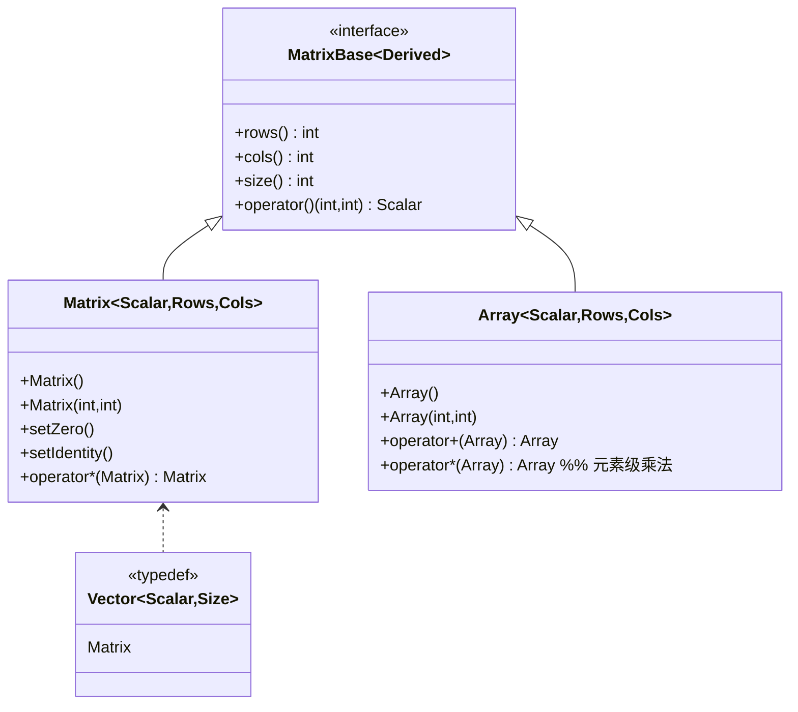
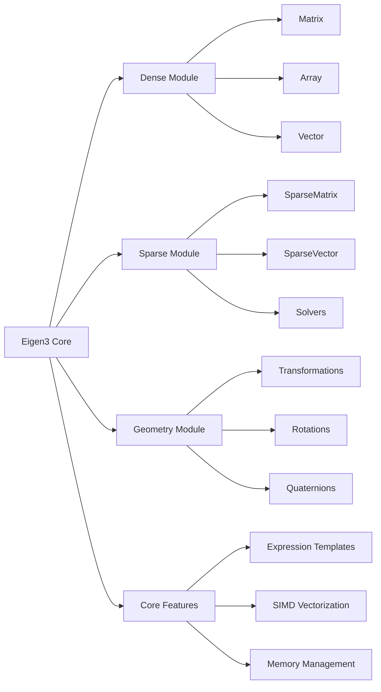

# 第一章：基础知识

## 类层次结构

> 本章介绍 Eigen 的基础矩阵类（与稀疏矩阵相对的稠密矩阵）。更多特殊矩阵类请参见：
> - 稀疏矩阵：[第七章](chp07.md#类层次结构)
> - 几何变换：[第六章](chp06.md#类层次结构)
> - 特征值分解：[第五章](chp05.md#类层次结构)



### 类说明
1. MatrixBase：所有矩阵类型的基类
   - 使用 CRTP 模式实现静态多态
   - 定义了基本的矩阵操作接口

2. Matrix：主要的矩阵类
   - 支持固定大小和动态大小
   - 提供丰富的矩阵运算功能
   - Vector 是 Matrix 的特化形式
   - 详细运算方法见[第二章](chp02.md#基本运算)

3. Array：数组类
   - 用于元素级运算
   - 与 Matrix 可以相互转换
   - 常用于图像处理和信号处理

## Eigen 简介
Eigen 是一个强大的 C++ 模板库，主要用于线性代数、矩阵、向量运算。从2006年发布的Eigen1开始，经历了Eigen2（2009年）和Eigen3（2010年至今）的发展。本教程使用 Eigen 3.4 版本。

### 核心特性
- 高性能：
  - 经过高度优化，支持 SIMD 指令自动向量化
  - 可选的 OpenMP 并行化支持
  - 智能的内存管理和缓存优化
- 易用性：
  - 接口简洁直观，类似 MATLAB 语法
  - 强大的运算符重载支持
  - 丰富的文档和示例
  - 完善的错误检查机制
- 可靠性：
  - 被广泛应用于工业界（如 Google Ceres、ROS）和学术界
  - 完善的单元测试覆盖
  - 活跃的社区支持
  - 经过实战验证的稳定性
- 无外部依赖：
  - 仅需要 C++ 标准库
  - 头文件模板库，易于集成
  - 跨平台支持（Windows、Linux、macOS）

### 实现特点
- 模板元编程：
  - 编译期优化和类型检查
  - 静态多态性能优化
  - 零运行时开销的抽象
- 表达式模板：
  - 避免临时对象的创建
  - 实现惰性求值
  - 自动优化计算顺序
- 内存布局：
  - 默认采用列优先存储，可选行优先存储
  - 16字节内存对齐（需要特定场景下手动处理）
  - 灵活的稀疏矩阵存储格式

### Eigen3 框架结构



Eigen3 的框架主要由以下几个部分组成：

1. Eigen3 Core（核心模块）
   - 提供基础的数据结构和算法
   - 包含表达式模板、向量化和内存管理等核心功能
   - 是其他所有模块的基础

2. Dense Module（稠密矩阵模块）
   - Matrix：基本的稠密矩阵类，支持各种矩阵运算
   - Array：用于元素级运算的数组类
   - Vector：向量类，是 Matrix 的特化形式

3. Sparse Module（稀疏矩阵模块）
   - SparseMatrix：高效的稀疏矩阵存储和运算
   - SparseVector：稀疏向量实现
   - Solvers：专门的稀疏矩阵求解器

4. Geometry Module（几何模块）
   - Transformations：2D/3D 变换
   - Rotations：旋转矩阵、欧拉角等
   - Quaternions：四元数实现

5. Core Features（核心特性）
   - Expression Templates：表达式模板技术，优化计算性能
   - SIMD Vectorization：自动向量化支持
   - Memory Management：高效的内存管理机制

## 基本数据类型

Eigen 的数据类型系统设计灵活而强大，能够满足不同场景的需求。主要分为固定大小类型和动态大小类型两大类。固定大小类型在编译期确定大小，性能更优但缺乏灵活性；动态大小类型可以在运行时改变大小，更灵活但有轻微的性能开销。此外，Eigen 还提供了多种特殊矩阵类型，用于优化特定场景下的存储和计算。

### 固定大小类型
- `Matrix<double, 3, 3>` 或 `Matrix3d`: 3x3 双精度矩阵
- `Matrix<float, 3, 3>` 或 `Matrix3f`: 3x3 单精度矩阵
- `Vector3d`: 3维双精度向量
- `Vector3f`: 3维单精度向量

### 动态大小类型
- `MatrixXd`: 动态大小双精度矩阵
- `MatrixXf`: 动态大小单精度矩阵
- `VectorXd`: 动态大小双精度向量
- `VectorXf`: 动态大小单精度向量

### 特殊矩阵
- `DiagonalMatrix<T, Size>`: 对角矩阵
  - T 为数据类型（如 double, float）
  - Size 为矩阵大小（-1 表示动态大小）
  - 示例：`DiagonalMatrix<double, 3>` 或 `DiagonalMatrix<double, Dynamic>`

- `SparseMatrix<T>`: 稀疏矩阵
  - 适用于大多数元素为零的矩阵
  - 默认使用列优先存储
  - 示例：`SparseMatrix<double> sparse(1000,1000);`

## 矩阵初始化

Eigen 提供了多种初始化方法，包括特殊矩阵初始化、逗号初始化、静态成员函数初始化等。这些方法各有特点，适用于不同的场景。当然，如果支持 C++17 及以上版本，还可以使用列表初始化。

### 常用初始化方法

```cpp
// 零矩阵
Matrix3d zero = Matrix3d::Zero();

// 单位矩阵
Matrix3d identity = Matrix3d::Identity();

// 随机矩阵
Matrix3d random = Matrix3d::Random();

// 常数矩阵
Matrix3d constant = Matrix3d::Constant(1.0);
```

### 逗号初始化

```cpp
Matrix3d m;
m << 1, 2, 3,
     4, 5, 6,
     7, 8, 9;
```

逗号初始化器（Comma Initializer）是 Eigen 提供的一种直观的矩阵初始化语法：
- 使用 `<<` 运算符开始初始化
- 按行优先顺序填充元素
- 使用逗号分隔元素，使用换行提高可读性
- 必须提供与矩阵大小完全匹配的元素个数
- 支持嵌套使用，可以组合多个表达式：

```cpp
Matrix4d m;
Matrix2d a; a << 1, 2,
               3, 4;
Matrix2d b; b << 5, 6,
               7, 8;
m << a, b,
     b, a;  // 创建 2x2 的块矩阵
```

逗号初始化器的实现利用了 C++ 的多个高级特性：

1. 运算符重载

```cpp
// 简化的实现示意
template<typename Derived>
class CommaInitializer {
    Derived& matrix;    // 被初始化的矩阵
    Index row, col;     // 当前位置

public:
    // << 运算符启动初始化序列
    CommaInitializer(Derived& mat) 
        : matrix(mat), row(0), col(0) {}

    // 处理每个逗号分隔的值
    template<typename T>
    CommaInitializer& operator,(const T& val) {
        matrix(row, col) = val;
        
        // 更新位置
        if (++col >= matrix.cols()) {
            col = 0;
            ++row;
        }
        return *this;
    }

    // 析构函数检查是否完整初始化
    ~CommaInitializer() {
        eigen_assert(row == matrix.rows() && col == 0);
    }
};

// Matrix 类中的运算符
template<typename T>
CommaInitializer operator<<(Matrix& mat, const T& val) {
    CommaInitializer init(mat);
    init, val;  // 处理第一个值
    return init;
}
```

2. RAII（资源获取即初始化）模式
- CommaInitializer 对象在初始化序列结束时自动销毁
- 析构函数检查初始化是否完整
- 防止初始化不完整或过度初始化

3. 表达式模板技术
- 支持嵌套表达式和块矩阵
- 编译期优化，无运行时开销
- 类型安全检查

4. 编译期优化

```cpp
// 编译器会将这样的代码
Matrix3d m;
m << 1, 2, 3,
     4, 5, 6,
     7, 8, 9;

// 优化为等效的直接赋值
m(0,0) = 1; m(0,1) = 2; m(0,2) = 3;
m(1,0) = 4; m(1,1) = 5; m(1,2) = 6;
m(2,0) = 7; m(2,1) = 8; m(2,2) = 9;
```

5. 安全性保证
- 编译期检查矩阵大小（对于固定大小矩阵）
- 运行时检查初始化完整性
- 类型转换安全性检查

这种实现方式提供了：
- 直观的语法
- 零运行时开销
- 完整的类型和边界检查
- 良好的编译器优化支持

## 基本操作

### 元素访问
- 使用 `()` 运算符：`matrix(i,j)`
- 使用 `.coeff(i,j)`：同上，但有边界检查
- 行列访问：`.row(i)`, `.col(j)`

元素访问的效率和安全性说明：
1. 运算符 `()` 访问
   - 最高效的访问方式
   - 无边界检查，适用于确保安全的场景
   - 支持左值引用，可以修改元素

   ```cpp
   matrix(0,0) = 1.0;  // 直接修改元素
   ```

2. coeff() 方法
   - 包含边界检查，更安全但略微降低性能
   - 用于需要保证安全的场景
   - 也提供 coeffRef() 用于可修改访问

   ```cpp
   double val = matrix.coeff(i,j);     // 只读访问
   matrix.coeffRef(i,j) = 2.0;         // 可修改访问
   ```

3. 行列访问
   - 返回行或列的视图，不会复制数据
   - 支持进一步的向量运算
   - 可以与其他向量或矩阵块组合使用

   ```cpp
   auto row = matrix.row(0);           // 获取第一行
   Vector3d col = matrix.col(1);       // 获取第二列并复制
   matrix.row(0).array() += 1.0;       // 整行操作
   ```

### 矩阵块操作
- 固定大小块：`.block<p,q>(i,j)`
- 动态大小块：`.block(i,j,p,q)`
- 行块：`.row(i)`
- 列块：`.col(j)`

矩阵块操作提供了灵活的子矩阵访问方式：

1. 固定大小块操作
   - 编译期确定大小，性能最优
   - 模板参数指定块大小
   - 适用于大小固定的场景

   ```cpp
   Matrix4d m;
   auto block = m.block<2,2>(1,1);  // 提取2x2块，起始于(1,1)
   ```

2. 动态大小块操作
   - 运行时确定大小，更灵活
   - 参数指定起始位置和块大小
   - 适用于大小可变的场景

   ```cpp
   MatrixXd m(4,4);
   auto block = m.block(1,1,2,2);  // 同样提取2x2块
   ```

3. 特殊块操作

   ```cpp
   // 头部和尾部块
   auto topRows = m.topRows(2);      // 前2行
   auto bottomRows = m.bottomRows(2); // 后2行
   auto leftCols = m.leftCols(2);    // 左2列
   auto rightCols = m.rightCols(2);  // 右2列
   
   // 角部块
   auto topLeft = m.topLeftCorner(2,2);
   auto bottomRight = m.bottomRightCorner(2,2);
   ```

4. 块操作的应用
   - 可以用于矩阵分块计算
   - 支持赋值和运算操作
   - 创建矩阵视图，不会复制数据

   ```cpp
   Matrix4d m = Matrix4d::Random();
   m.block<2,2>(0,0) = Matrix2d::Identity();  // 替换左上角为单位矩阵
   m.block(2,2,2,2) *= 2.0;                   // 右下角块乘以2
   ```

### 矩阵属性
- 大小：`.rows()`, `.cols()`, `.size()`
- 最大/最小值：`.maxCoeff()`, `.minCoeff()`
- 求和：`.sum()`
- 迹：`.trace()`

矩阵属性操作提供了丰富的矩阵信息查询和计算功能：

1. 基本属性

   ```cpp
   Matrix3d m = Matrix3d::Random();
   int rows = m.rows();      // 行数
   int cols = m.cols();      // 列数
   int size = m.size();      // 总元素个数
   bool isEmpty = m.empty(); // 是否为空
   ```

2. 统计属性

   ```cpp
   double maxVal = m.maxCoeff();  // 最大元素
   double minVal = m.minCoeff();  // 最小元素
   double sum = m.sum();          // 所有元素之和
   double mean = m.mean();        // 平均值
   double trace = m.trace();      // 迹（对角线元素和）
   ```

3. 带索引的最值查找

   ```cpp
   Matrix3d m = Matrix3d::Random();
   Index maxRow, maxCol;
   double maxVal = m.maxCoeff(&maxRow, &maxCol);  // 同时返回最大值位置
   
   Index minRow, minCol;
   double minVal = m.minCoeff(&minRow, &minCol);  // 同时返回最小值位置
   ```

4. 范数计算

   ```cpp
   double norm1 = m.lpNorm<1>();      // L1范数
   double norm2 = m.norm();           // L2范数（默认）
   double normInf = m.lpNorm<Infinity>(); // 无穷范数
   ```

5. 其他属性

   ```cpp
   bool isZero = m.isZero();           // 是否为零矩阵
   bool isOnes = m.isOnes();           // 是否为全1矩阵
   bool isIdentity = m.isIdentity();   // 是否为单位矩阵
   bool isDiagonal = m.isDiagonal();   // 是否为对角矩阵
   ```

这些属性操作的特点：
- 大多数操作都是实时计算的
- 某些操作（如范数计算）可能涉及较大计算量
- 支持链式操作
- 可以与条件判断结合使用

## 代码示例说明

### basic_matrix.cpp

```cpp
#include <Eigen/Dense>
using namespace Eigen;

int main() {
    // 1. 创建不同类型的矩阵
    Matrix3d m3d;           // 3x3 双精度矩阵
    Matrix<float, 4, 4> m4f;  // 4x4 单精度矩阵
    MatrixXd mXd(5, 5);     // 动态大小双精度矩阵
    
    // 2. 矩阵初始化
    m3d = Matrix3d::Zero();     // 零矩阵
    m4f = Matrix4f::Identity(); // 单位矩阵
    mXd = MatrixXd::Random(5, 5); // 随机矩阵
    
    // 3. 使用逗号初始化
    Matrix3d m;
    m << 1, 2, 3,
         4, 5, 6,
         7, 8, 9;
    
    // 4. 元素访问
    double val1 = m(0,0);    // 使用()访问元素
    double val2 = m.coeff(1,1); // 使用coeff()访问
    
    // 5. 矩阵块操作
    auto block = m.block<2,2>(0,0); // 提取2x2块
    auto row = m.row(0);    // 提取第一行
    auto col = m.col(1);    // 提取第二列
    
    return 0;
}
```

代码分析：
1. 头文件和命名空间：
   - `Eigen/Dense` 包含了密集矩阵的所有功能
   - 使用 Eigen 命名空间简化代码

2. 矩阵类型：
   - `Matrix3d`: 固定大小 3x3 双精度矩阵
   - `Matrix<float,4,4>`: 通用模板形式
   - `MatrixXd`: 动态大小矩阵

3. 初始化方法：
   - 静态成员函数：Zero(), Identity(), Random()
   - 逗号初始化器：直观的矩阵填充方式

### matrix_arithmetic.cpp

```cpp
#include <Eigen/Dense>
using namespace Eigen;

int main() {
    Matrix2d a, b;
    a << 1, 2,
         3, 4;
    b << 5, 6,
         7, 8;
    
    // 1. 基本运算
    Matrix2d sum = a + b;    // 矩阵加法
    Matrix2d diff = a - b;   // 矩阵减法
    Matrix2d prod = a * b;   // 矩阵乘法
    
    // 2. 标量运算
    Matrix2d scaled = 2.0 * a;  // 标量乘法
    Matrix2d inv = a.inverse(); // 矩阵求逆
    
    // 3. 元素级运算
    Matrix2d cwiseProd = a.cwiseProduct(b); // 元素级乘法
    Matrix2d cwiseDiv = a.cwiseQuotient(b); // 元素级除法
    
    // 4. 矩阵属性
    double det = a.determinant(); // 行列式
    double tr = a.trace();        // 迹
    
    return 0;
}
```

代码分析：
1. 矩阵定义和初始化：
   - 使用 Matrix2d 表示 2x2 矩阵
   - 逗号初始化器填充数据

2. 基本运算：
   - 重载运算符：+, -, *
   - 矩阵乘法自动处理维度检查

3. 特殊运算：
   - cwiseProduct: 元素级乘法
   - cwiseQuotient: 元素级除法

4. 矩阵属性：
   - determinant(): 计算行列式
   - trace(): 计算矩阵的迹

5. 性能注意事项：
   - 矩阵求逆计算开销大
   - 元素级运算可能创建临时对象
   - 使用表达式模板优化计算

### special_matrices.cpp

```cpp
#include <Eigen/Dense>
using namespace Eigen;

int main() {
    // 1. 对角矩阵
    DiagonalMatrix<double, 3> diag(1, 2, 3);
    Matrix3d m = diag.toDenseMatrix();
    
    // 2. 三角矩阵
    Matrix3d tri = Matrix3d::Random();
    auto upper = tri.triangularView<Upper>();
    auto lower = tri.triangularView<Lower>();
    
    // 3. 置换矩阵
    PermutationMatrix<3> perm;
    perm.setIdentity();
    perm.indices()(0) = 2;
    perm.indices()(2) = 0;
    
    // 4. 特殊矩阵
    Matrix3d zero = Matrix3d::Zero();
    Matrix3d ones = Matrix3d::Ones();
    Matrix3d rand = Matrix3d::Random();
    
    return 0;
}
```

代码分析：
1. 对角矩阵：
   - DiagonalMatrix 专门的对角矩阵类
   - toDenseMatrix() 转换为普通矩阵
   - 存储效率高，只存储对角线元素

2. 三角矩阵：
   - triangularView 提供三角矩阵视图
   - Upper/Lower 模板参数指定类型
   - 优化三角矩阵相关运算

3. 置换矩阵：
   - PermutationMatrix 专门的置换矩阵类
   - indices() 访问置换索引
   - 用于矩阵分解和求解器中

4. 特殊矩阵：
   - Zero(): 全零矩阵
   - Ones(): 全一矩阵
   - Random(): 随机矩阵
   - 提供快速初始化方法

5. 内存和性能：
   - 特殊矩阵类型节省内存
   - 利用特殊结构优化计算
   - 视图不会创建新的存储

## 注意事项
1. 固定大小vs动态大小
   - 固定大小更高效，但不够灵活
   - 动态大小更灵活，但有轻微性能开销

2. 内存对齐
   - Eigen默认要求16字节对齐
   - 使用 `EIGEN_MAKE_ALIGNED_OPERATOR_NEW` 宏

3. 编译优化
   - 建议开启优化选项 `-O2` 或 `-O3`
   - 可以使用 `-march=native`