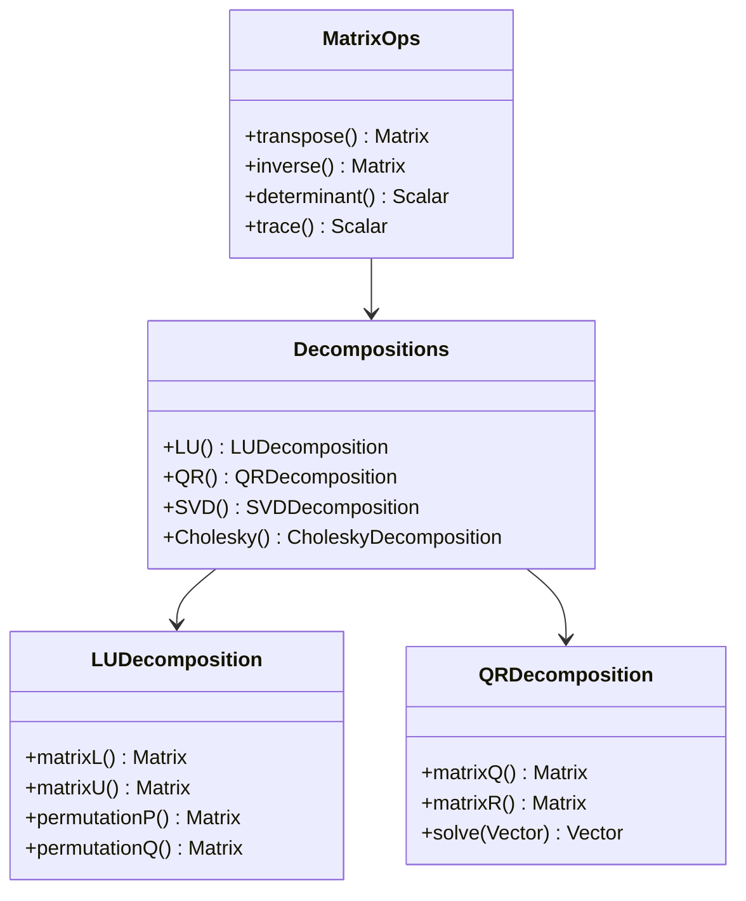

# Eigen 教程


# 第二章：矩阵操作

## 类层次结构

> 本章介绍矩阵运算和分解相关的类。相关内容请参见：
> - 线性方程求解：[第四章](chp04.md#类层次结构)
> - 特征值分解：[第五章](chp05.md#类层次结构)
> - 稀疏矩阵运算：[第七章](chp07.md#类层次结构)



### 类说明
1. MatrixOps：基本矩阵运算
   - 提供基础的矩阵变换操作
   - 实现常用的矩阵计算方法
   - 继承自[第一章](chp01.md#类层次结构)的 MatrixBase

2. Decompositions：矩阵分解
   - 提供多种矩阵分解方法
   - 用于求解线性方程组和特征值
   - 详细求解器说明见[第四章](chp04.md#类层次结构)

## 2.1 基本运算

### 2.1.1 矩阵代数运算
- 加减法：O(n²) 复杂度
- 矩阵乘法：O(n³) 复杂度
- 转置：O(1) 视图操作
- 求逆：O(n³) LU分解

## 2.2 矩阵分解
### LU分解
```cpp
FullPivLU<Matrix3d> lu(A);
Matrix3d L = lu.matrixLU().triangularView<Lower>();
Matrix3d U = lu.matrixLU().triangularView<Upper>();
```

### QR分解
```cpp
HouseholderQR<Matrix3d> qr(A);
Matrix3d Q = qr.householderQ();
Matrix3d R = qr.matrixQR().triangularView<Upper>();
```

### SVD分解
```cpp
JacobiSVD<Matrix3d> svd(A);
Vector3d singular_values = svd.singularValues();
Matrix3d U = svd.matrixU();
Matrix3d V = svd.matrixV();
```

### Cholesky分解
```cpp
LLT<Matrix3d> llt(A);  // A 必须是正定矩阵
Matrix3d L = llt.matrixL();
```

## 2.3 高级操作
### 矩阵的迹
```cpp
double trace = A.trace();
```

### 矩阵的范数
```cpp
double norm = A.norm();         // Frobenius范数
double normInf = A.lpNorm<Infinity>();  // 无穷范数
```

### 矩阵的条件数
```cpp
JacobiSVD<Matrix3d> svd(A);
double cond = svd.singularValues()(0) / svd.singularValues()(svd.singularValues().size()-1);
```

### 矩阵的秩
```cpp
int rank = A.fullPivLu().rank();
```

## 2.4 代码示例说明

### matrix_operations.cpp
```cpp
#include <Eigen/Dense>
using namespace Eigen;

int main() {
    // 1. 基本矩阵运算
    Matrix3d A = Matrix3d::Random();
    Matrix3d B = Matrix3d::Random();
    
    // 加减乘运算
    Matrix3d C = A + B;
    Matrix3d D = A - B;
    Matrix3d E = A * B;
    
    // 转置和求逆
    Matrix3d AT = A.transpose();
    Matrix3d AI = A.inverse();
    
    // 行列式和迹
    double det = A.determinant();
    double tr = A.trace();
    
    // 范数计算
    double normF = A.norm();      // Frobenius范数
    double normInf = A.lpNorm<Infinity>();  // 无穷范数
    
    return 0;
}
```

代码分析：
1. 基本运算：
   - 使用重载运算符进行矩阵运算
   - 自动进行维度检查
   - 编译期优化计算顺序

2. 高级运算：
   - transpose(): 矩阵转置，O(1)操作
   - inverse(): 矩阵求逆，O(n³)操作
   - determinant(): 行列式计算

3. 范数计算：
   - norm(): 默认为Frobenius范数
   - lpNorm<T>(): 可指定范数类型
   - 常用于误差分析

### matrix_decompositions.cpp
```cpp
#include <Eigen/Dense>
using namespace Eigen;

int main() {
    Matrix3d A = Matrix3d::Random();
    A = A * A.transpose();  // 确保对称正定
    
    // LU分解
    FullPivLU<Matrix3d> lu(A);
    Matrix3d L = lu.matrixLU().triangularView<Lower>();
    Matrix3d U = lu.matrixLU().triangularView<Upper>();
    
    // QR分解
    HouseholderQR<Matrix3d> qr(A);
    Matrix3d Q = qr.householderQ();
    Matrix3d R = qr.matrixQR().triangularView<Upper>();
    
    // SVD分解
    JacobiSVD<Matrix3d> svd(A, ComputeFullU | ComputeFullV);
    Matrix3d U = svd.matrixU();
    Vector3d S = svd.singularValues();
    Matrix3d V = svd.matrixV();
    
    return 0;
}
```

代码分析：
1. 矩阵准备：
   - 使用Random()生成随机矩阵
   - A*A.transpose()确保对称正定

2. LU分解：
   - FullPivLU提供完全主元选取
   - 分别提取上下三角部分
   - 适用于一般方阵

3. QR分解：
   - HouseholderQR使用豪斯霍尔德变换
   - 提供正交矩阵Q和上三角矩阵R
   - 适用于任意矩形矩阵

4. SVD分解：
   - JacobiSVD使用雅可比迭代
   - ComputeFullU|V 控制计算完整分解
   - 最稳定但计算开销较大

## 2.5 性能优化建议
1. 避免显式求逆
   - 使用求解器代替求逆
   - 例如：用 `A.colPivHouseholderQr().solve(b)` 代替 `A.inverse() * b`

2. 利用矩阵的特殊结构
   - 对称矩阵使用 `selfadjointView()`
   - 三角矩阵使用 `triangularView()`

3. 预分配内存
   - 对于动态大小矩阵，使用 `reserve()` 预分配空间
   - 避免频繁的内存重分配 