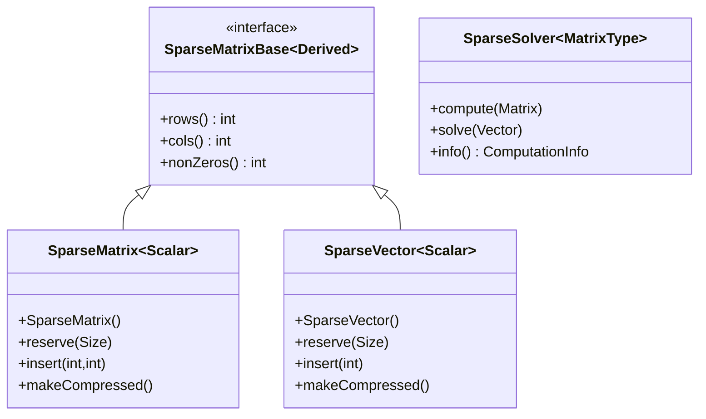
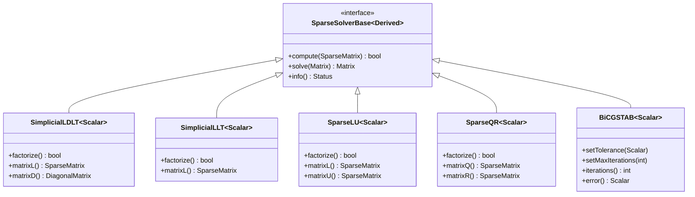
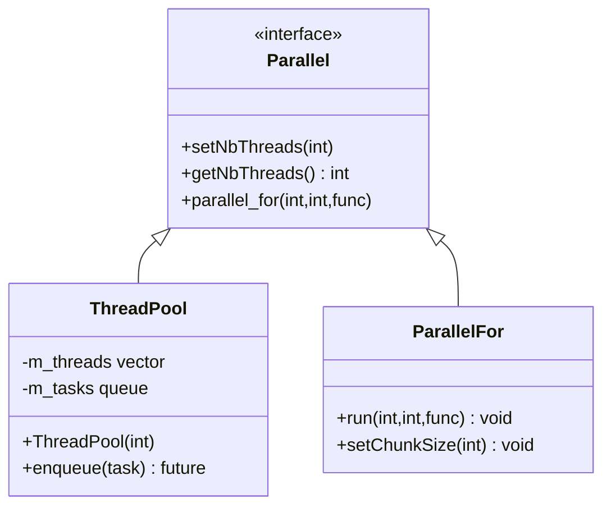

# 第七章：稀疏矩阵

## 类层次结构

> 本章介绍稀疏矩阵相关的类。相关内容请参见：
> - 矩阵基础：[第一章](chp01.md#类层次结构)
> - 线性求解：[第四章](chp04.md#类层次结构)
> - 特征值计算：[第五章](chp05.md#类层次结构)



### 类说明
1. SparseMatrixBase：稀疏矩阵基类
   - 定义了基本的稀疏矩阵接口
   - 提供非零元素访问方法
   - 继承自[第一章](chp01.md#类层次结构)的 MatrixBase

2. SparseMatrix：稀疏矩阵类
   - 支持动态大小和固定大小
   - 提供高效的元素插入和访问
   - 使用压缩行/列存储格式(CSR/CSC)

3. SparseVector：稀疏向量类
   - 适用于大部分元素为零的向量
   - 支持向量运算和矩阵运算
   - 与稠密向量可以互相转换

4. SparseSolver：稀疏求解器类
   - 专门用于求解稀疏线性系统
   - 支持直接法和迭代法
   - 详细求解方法见[第四章](chp04.md#迭代求解方法)

## 7.1 基本概念

### 7.1.1 稀疏存储格式
- CSR：压缩行存储，O(1)行访问
- CSC：压缩列存储，O(1)列访问
- COO：坐标格式，适合构建过程
- 存储开销：O(nnz)，nnz为非零元素个数

## 7.2 求解器类层次结构



### 类说明
1. SparseSolverBase：所有稀疏求解器的基类
   - 定义了求解器的基本接口
   - 提供状态查询功能

2. 直接求解器：
   - SimplicialLDLT：LDLT分解求解器
   - SimplicialLLT：Cholesky分解求解器
   - SparseLU：LU分解求解器
   - SparseQR：QR分解求解器

3. 迭代求解器：
   - BiCGSTAB：双共轭梯度稳定法
   - 可设置收敛条件和最大迭代次数

## 7.3 并行计算支持




### 类说明
1. 并行计算基础设施：
   - 线程池管理
   - 任务调度
   - 负载均衡

2. 并行算法支持：
   - 矩阵乘法并行化
   - 分块运算
   - SIMD优化

## 7.4 高级操作

### 7.4.1 矩阵块操作
```cpp
// 动态块
matrix.block(i,j,p,q)

// 固定大小块
matrix.block<p,q>(i,j)

// 行和列块
matrix.row(i)
matrix.col(j)
```

### 7.4.2 广播操作
```cpp
// 按行广播
matrix.rowwise() += vector;

// 按列广播
matrix.colwise() += vector;
```

### 7.4.3 数组操作
```cpp
// 元素级操作
Array3d a, b;
Array3d c = a * b;  // 元素级乘法
Array3d d = a.max(b);  // 元素级最大值
}

## 7.5 性能优化

### 7.5.1 内存对齐
```cpp
class MyClass {
    Matrix4d matrix;
    EIGEN_MAKE_ALIGNED_OPERATOR_NEW
}

### 7.5.2 编译优化
```cpp
// 启用向量化
#define EIGEN_VECTORIZE

// 固定大小矩阵优化
Matrix<double,4,4,ColMajor|AutoAlign>
}
```
### 7.5.3 并行计算
```cpp
// 设置线程数
Eigen::setNbThreads(4);

// 获取当前线程数
int threads = Eigen::nbThreads();
}
```
## 7.6 代码示例说明

### sparse_matrix.cpp
展示了稀疏矩阵的使用：
- 创建和填充稀疏矩阵
- 基本运算
- 求解稀疏线性系统

### advanced_features.cpp
展示了高级特性的使用：
- 矩阵块操作
- 广播操作
- 并行计算

## 7.7 最佳实践
1. 内存管理
   - 预分配内存
   - 使用适当的存储顺序
   - 注意内存对齐

2. 编译优化
   - 使用编译器优化选项
   - 启用SIMD指令
   - 使用固定大小类型

3. 调试技巧
   - 使用断言检查
   - 监控数值稳定性
   - 性能分析

### 7.3.2 稀疏矩阵运算
```cpp
// 矩阵-向量乘法
VectorXd x = VectorXd::Random(1000);
VectorXd y = sparse * x;

// 矩阵-矩阵乘法
SparseMatrix<double> result = sparse1 * sparse2;

// 转置
SparseMatrix<double> transposed = sparse.transpose();

// 求解线性方程组
SimplicialLDLT<SparseMatrix<double>> solver;
solver.compute(sparse);
VectorXd x = solver.solve(b);
}
```

让我们分析这些操作：
1. 矩阵-向量乘法：
   - 利用稀疏结构优化计算
   - 只计算非零元素的贡献
   - 时间复杂度与非零元素数量成正比

2. 矩阵-矩阵乘法：
   - 自动选择最优的乘法算法
   - 保持结果的稀疏性
   - 可以预估结果的非零模式

3. 线性方程求解：
   - 使用专门的稀疏矩阵求解器
   - 自动选择最优的分解方法
   - 支持重复使用分解结果

## 7.4 并行计算

### 7.4.1 基本线程操作
```cpp
// 设置线程数
Eigen::setNbThreads(4);

// 获取当前线程数
int threads = Eigen::nbThreads();

// 并行块操作
#pragma omp parallel for
for(int i = 0; i < rows; ++i) {
    result.row(i) = matrix.row(i) * vector;
}
```
### 7.4.2 线程池使用
```cpp
// 创建线程池
ThreadPool pool(4);

// 提交任务
auto future = pool.enqueue([](int i) {
    return heavyComputation(i);
}, 42);

// 获取结果
int result = future.get();
}
```
## 7.5 高级优化技术

### 7.5.1 内存对齐
```cpp
class MyClass {
    Matrix4d matrix;  // 固定大小的Eigen对象
    EIGEN_MAKE_ALIGNED_OPERATOR_NEW  // 确保16字节对齐
}
```
### 7.5.2 表达式模板
```cpp
// 避免创建临时对象
MatrixXd result = (matrix1 * vector).cwiseAbs() + vector2;

// 显式求值
MatrixXd result = (matrix1 * vector).eval();
}
```
### 7.5.3 SIMD优化
```cpp
// 启用向量化
#define EIGEN_VECTORIZE

// 使用对齐的数据类型
Matrix<double,4,4,ColMajor|AutoAlign> matrix;
}
```
## 7.6 代码示例详解

### 7.6.1 sparse_matrix.cpp
```cpp
#include <Eigen/Sparse>
using namespace Eigen;

int main() {
    // 创建稀疏矩阵
    SparseMatrix<double> mat(1000, 1000);
    mat.reserve(VectorXi::Constant(1000, 3));
    
    // 填充三对角矩阵
    for(int i = 0; i < 1000; ++i) {
        mat.insert(i, i) = 2.0;
        if(i > 0) mat.insert(i, i-1) = -1.0;
        if(i < 999) mat.insert(i, i+1) = -1.0;
    }
    mat.makeCompressed();
    
    // 求解方程 Ax = b
    VectorXd b = VectorXd::Random(1000);
    SimplicialLDLT<SparseMatrix<double>> solver;
    solver.compute(mat);
    VectorXd x = solver.solve(b);
    
    return 0;
}
```

分析：
1. 矩阵创建：
   - 预分配空间提高效率
   - 使用insert添加元素
   - 压缩存储格式

2. 求解器使用：
   - 选择适合对称正定矩阵的求解器
   - 分解和求解分开进行
   - 可以重用分解结果

### 7.6.2 parallel_computation.cpp
```cpp
#include <Eigen/Core>
#include <Eigen/Dense>
using namespace Eigen;

int main() {
    // 设置线程数
    setNbThreads(4);
    
    // 大矩阵运算
    MatrixXd A = MatrixXd::Random(1000, 1000);
    MatrixXd B = MatrixXd::Random(1000, 1000);
    
    // 自动并行化的矩阵乘法
    MatrixXd C = A * B;
    
    // 手动并行化
    #pragma omp parallel for
    for(int i = 0; i < A.rows(); ++i) {
        C.row(i) = A.row(i) * B;
    }
    
    return 0;
}
```

分析：
1. 并行设置：
   - 全局设置线程数
   - 自动并行化大型运算
   - OpenMP支持手动并行

2. 性能考虑：
   - 只并行化计算密集型任务
   - 考虑数据访问模式
   - 避免过多的线程切换

## 7.7 最佳实践

1. 稀疏矩阵使用：
   - 选择合适的存储格式
   - 预分配足够的空间
   - 使用专门的稀疏算法

2. 并行计算：
   - 合理设置线程数
   - 注意数据竞争
   - 选择合适的并行粒度

3. 内存管理：
   - 使用对齐的数据结构
   - 避免不必要的拷贝
   - 重用临时对象

4. 调试技巧：
   - 使用断言检查
   - 监控性能瓶颈
   - 验证数值稳定性 