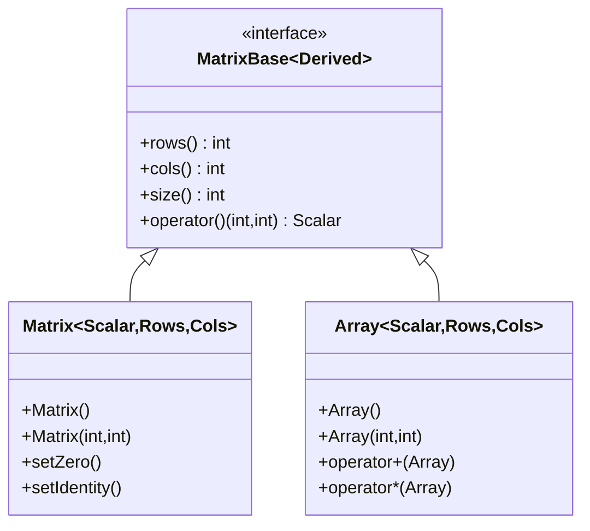
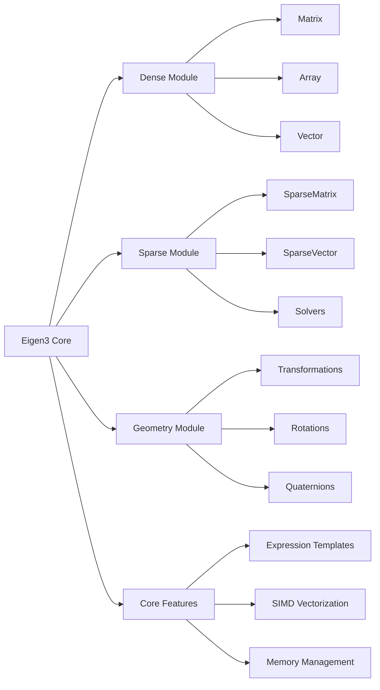

# 第一章：基础知识

## 类层次结构

> 本章介绍 Eigen 的基础矩阵类。更多特殊矩阵类请参见：
> - 稀疏矩阵：[第七章](chp07.md#类层次结构)
> - 几何变换：[第六章](chp06.md#类层次结构)
> - 特征值分解：[第五章](chp05.md#类层次结构)



### 类说明
1. MatrixBase：所有矩阵类型的基类
   - 使用 CRTP 模式实现静态多态
   - 定义了基本的矩阵操作接口

2. Matrix：主要的矩阵类
   - 支持固定大小和动态大小
   - 提供丰富的矩阵运算功能
   - 详细运算方法见[第二章](chp02.md#基本运算)

3. Array：数组类
   - 用于元素级运算
   - 与 Matrix 可以相互转换
   - 常用于图像处理和信号处理

## 1.1 Eigen 简介
Eigen 是一个强大的 C++ 模板库，主要用于线性代数、矩阵、向量运算。从2006年发布的Eigen1开始，经历了Eigen2（2009年）和Eigen3（2010年至今）的发展。本教程使用 Eigen 3.4 版本。

### 1.1.1 核心特性
- 高性能：
  - 经过高度优化，支持 SIMD 指令
  - 采用表达式模板技术，实现延迟计算
  - 自动向量化和并行化处理
  - 智能的内存管理和缓存优化
- 易用性：
  - 接口简洁直观，类似 MATLAB 语法
  - 强大的运算符重载支持
  - 丰富的文档和示例
  - 完善的错误检查机制
- 可靠性：
  - 被广泛应用于工业界（如 Google Ceres、ROS）和学术界
  - 完善的单元测试覆盖
  - 活跃的社区支持
  - 经过实战验证的稳定性
- 无外部依赖：
  - 仅需要 C++ 标准库
  - 头文件模板库，易于集成
  - 跨平台支持（Windows、Linux、macOS）

### 1.1.2 实现特点
- 模板元编程：
  - 编译期优化和类型检查
  - 静态多态性能优化
  - 零运行时开销的抽象
- 表达式模板：
  - 避免临时对象的创建
  - 实现惰性求值
  - 自动优化计算顺序
- 内存布局：
  - 支持行优先和列优先存储
  - 自动内存对齐优化
  - 灵活的稀疏矩阵存储格式

### 1.1.3 Eigen3 框架结构



## 1.2 基本数据类型

### 固定大小类型
- `Matrix<double, 3, 3>` 或 `Matrix3d`: 3x3 双精度矩阵
- `Matrix<float, 3, 3>` 或 `Matrix3f`: 3x3 单精度矩阵
- `Vector3d`: 3维双精度向量
- `Vector3f`: 3维单精度向量

### 动态大小类型
- `MatrixXd`: 动态大小双精度矩阵
- `MatrixXf`: 动态大小单精度矩阵
- `VectorXd`: 动态大小双精度向量
- `VectorXf`: 动态大小单精度向量

### 特殊矩阵
- `DiagonalMatrix<T, Size>`: 对角矩阵
  - T 为数据类型（如 double, float）
  - Size 为矩阵大小（-1 表示动态大小）
  - 示例：`DiagonalMatrix<double, 3>` 或 `DiagonalMatrix<double, Dynamic>`

- `SparseMatrix<T>`: 稀疏矩阵
  - 适用于大多数元素为零的矩阵
  - 默认使用列优先存储
  - 示例：`SparseMatrix<double> sparse(1000,1000);`

## 1.3 矩阵初始化

### 1.3.1 常用初始化方法
```cpp
// 零矩阵
Matrix3d zero = Matrix3d::Zero();

// 单位矩阵
Matrix3d identity = Matrix3d::Identity();

// 随机矩阵
Matrix3d random = Matrix3d::Random();

// 常数矩阵
Matrix3d constant = Matrix3d::Constant(1.0);
```

### 1.3.2 逗号初始化
```cpp
Matrix3d m;
m << 1, 2, 3,
     4, 5, 6,
     7, 8, 9;
```

## 1.4 基本操作

### 1.4.1 元素访问
- 使用 `()` 运算符：`matrix(i,j)`
- 使用 `.coeff(i,j)`：同上，但有边界检查
- 行列访问：`.row(i)`, `.col(j)`

### 1.4.2 矩阵块操作
- 固定大小块：`.block<p,q>(i,j)`
- 动态大小块：`.block(i,j,p,q)`
- 行块：`.row(i)`
- 列块：`.col(j)`

### 1.4.3 矩阵属性
- 大小：`.rows()`, `.cols()`, `.size()`
- 最大/最小值：`.maxCoeff()`, `.minCoeff()`
- 求和：`.sum()`
- 迹：`.trace()`

## 1.5 代码示例说明

### basic_matrix.cpp
```cpp
#include <Eigen/Dense>
using namespace Eigen;

int main() {
    // 1. 创建不同类型的矩阵
    Matrix3d m3d;           // 3x3 双精度矩阵
    Matrix<float, 4, 4> m4f;  // 4x4 单精度矩阵
    MatrixXd mXd(5, 5);     // 动态大小双精度矩阵
    
    // 2. 矩阵初始化
    m3d = Matrix3d::Zero();     // 零矩阵
    m4f = Matrix4f::Identity(); // 单位矩阵
    mXd = MatrixXd::Random(5, 5); // 随机矩阵
    
    // 3. 使用逗号初始化
    Matrix3d m;
    m << 1, 2, 3,
         4, 5, 6,
         7, 8, 9;
    
    // 4. 元素访问
    double val1 = m(0,0);    // 使用()访问元素
    double val2 = m.coeff(1,1); // 使用coeff()访问
    
    // 5. 矩阵块操作
    auto block = m.block<2,2>(0,0); // 提取2x2块
    auto row = m.row(0);    // 提取第一行
    auto col = m.col(1);    // 提取第二列
    
    return 0;
}
```

代码分析：
1. 头文件和命名空间：
   - `Eigen/Dense` 包含了密集矩阵的所有功能
   - 使用 Eigen 命名空间简化代码

2. 矩阵类型：
   - `Matrix3d`: 固定大小 3x3 双精度矩阵
   - `Matrix<float,4,4>`: 通用模板形式
   - `MatrixXd`: 动态大小矩阵

3. 初始化方法：
   - 静态成员函数：Zero(), Identity(), Random()
   - 逗号初始化器：直观的矩阵填充方式

4. 访问操作：
   - 操作符 () 用于快速访问
   - coeff() 提供边界检查

5. 块操作：
   - block<p,q>(i,j): 固定大小块
   - row(i), col(j): 行列访问

### matrix_arithmetic.cpp
```cpp
#include <Eigen/Dense>
using namespace Eigen;

int main() {
    Matrix2d a, b;
    a << 1, 2,
         3, 4;
    b << 5, 6,
         7, 8;
    
    // 1. 基本运算
    Matrix2d sum = a + b;    // 矩阵加法
    Matrix2d diff = a - b;   // 矩阵减法
    Matrix2d prod = a * b;   // 矩阵乘法
    
    // 2. 标量运算
    Matrix2d scaled = 2.0 * a;  // 标量乘法
    Matrix2d inv = a.inverse(); // 矩阵求逆
    
    // 3. 元素级运算
    Matrix2d cwiseProd = a.cwiseProduct(b); // 元素级乘法
    Matrix2d cwiseDiv = a.cwiseQuotient(b); // 元素级除法
    
    // 4. 矩阵属性
    double det = a.determinant(); // 行列式
    double tr = a.trace();        // 迹
    
    return 0;
}
```

代码分析：
1. 矩阵定义和初始化：
   - 使用 Matrix2d 表示 2x2 矩阵
   - 逗号初始化器填充数据

2. 基本运算：
   - 重载运算符：+, -, *
   - 矩阵乘法自动处理维度检查

3. 特殊运算：
   - cwiseProduct: 元素级乘法
   - cwiseQuotient: 元素级除法

4. 矩阵属性：
   - determinant(): 计算行列式
   - trace(): 计算矩阵的迹

5. 性能注意事项：
   - 矩阵求逆计算开销大
   - 元素级运算可能创建临时对象
   - 使用表达式模板优化计算

### special_matrices.cpp
```cpp
#include <Eigen/Dense>
using namespace Eigen;

int main() {
    // 1. 对角矩阵
    DiagonalMatrix<double, 3> diag(1, 2, 3);
    Matrix3d m = diag.toDenseMatrix();
    
    // 2. 三角矩阵
    Matrix3d tri = Matrix3d::Random();
    auto upper = tri.triangularView<Upper>();
    auto lower = tri.triangularView<Lower>();
    
    // 3. 置换矩阵
    PermutationMatrix<3> perm;
    perm.setIdentity();
    perm.indices()(0) = 2;
    perm.indices()(2) = 0;
    
    // 4. 特殊矩阵
    Matrix3d zero = Matrix3d::Zero();
    Matrix3d ones = Matrix3d::Ones();
    Matrix3d rand = Matrix3d::Random();
    
    return 0;
}
```

代码分析：
1. 对角矩阵：
   - DiagonalMatrix 专门的对角矩阵类
   - toDenseMatrix() 转换为普通矩阵
   - 存储效率高，只存储对角线元素

2. 三角矩阵：
   - triangularView 提供三角矩阵视图
   - Upper/Lower 模板参数指定类型
   - 优化三角矩阵相关运算

3. 置换矩阵：
   - PermutationMatrix 专门的置换矩阵类
   - indices() 访问置换索引
   - 用于矩阵分解和求解器中

4. 特殊矩阵：
   - Zero(): 全零矩阵
   - Ones(): 全一矩阵
   - Random(): 随机矩阵
   - 提供快速初始化方法

5. 内存和性能：
   - 特殊矩阵类型节省内存
   - 利用特殊结构优化计算
   - 视图不会创建新的存储

## 1.6 注意事项
1. 固定大小vs动态大小
   - 固定大小更高效，但不够灵活
   - 动态大小更灵活，但有轻微性能开销

2. 内存对齐
   - Eigen默认要求16字节对齐
   - 使用 `EIGEN_MAKE_ALIGNED_OPERATOR_NEW` 宏

3. 编译优化
   - 建议开启优化选项 `-O2` 或 `-O3`
   - 可以使用 `-march=native` 启用 SIMD 
