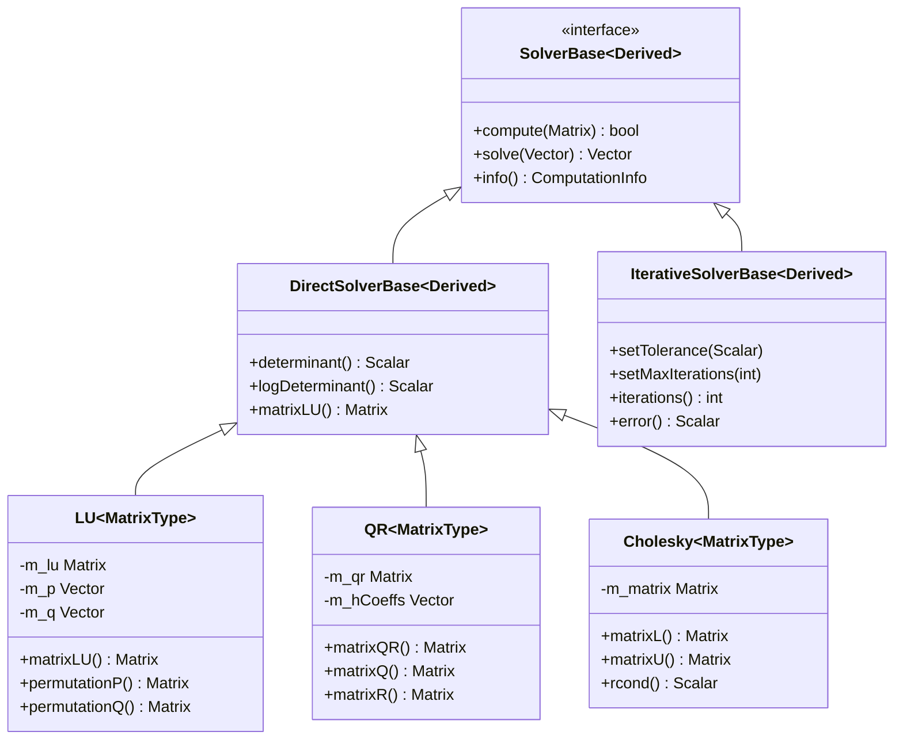

# Eigen 教程

## 教程目录
1. [基础知识](chp01.md)
   - 基本矩阵操作
   - 矩阵运算
   - 特殊矩阵
2. [矩阵操作](chp02.md)
   - 矩阵基本操作
   - 矩阵分解
3. [向量操作](chp03.md)
   - 向量基本操作
   - 向量高级特性
4. [线性方程](chp04.md)
   - 线性方程求解
   - 最小二乘法
5. [特征值](chp05.md)
   - 特征值计算
   - PCA实例
6. [几何变换](chp06.md)
   - 变换矩阵
   - 旋转矩阵
7. [高级特性](chp07.md)
   - 稀疏矩阵
   - 高级功能

<script type="module">
    import mermaid from 'https://cdn.jsdelivr.net/npm/mermaid@10/dist/mermaid.esm.min.mjs';
    mermaid.initialize({
        startOnLoad: true,
        theme: 'dark'
    });
</script>

# 第四章：线性方程求解

## 类层次结构

> 本章介绍线性方程求解相关的类。相关内容请参见：
> - 矩阵分解：[第二章](chp02.md#矩阵分解)
> - 特征值求解：[第五章](chp05.md#类层次结构)
> - 稀疏求解器：[第七章](chp07.md#类层次结构)



### 类说明
1. SolverBase：所有求解器的基类
   - 定义了基本的求解器接口
   - 提供计算状态查询功能
   - 支持链式操作和延迟计算

2. 直接法求解器：
   - LU：适用于一般方阵
   - QR：适用于任意矩形矩阵
   - Cholesky：适用于对称正定矩阵
   - 详细分解方法见[第二章](chp02.md#矩阵分解)

3. 迭代法求解器：
   - ConjugateGradient：共轭梯度法
   - BiCGSTAB：双共轭梯度稳定法
   - GMRES：广义最小残差法
   - 适用于大规模稀疏系统

## 4.1 基本概念

### 4.1.1 线性方程组
- 一般形式：Ax = b
- 计算复杂度：O(n³) 直接法
- 存储需求：O(n²) 稠密矩阵
- 迭代法：O(kn²) k为迭代次数

## 4.2 直接求解方法

### 4.2.1 LU分解求解
```cpp
Matrix3d A;
Vector3d b;
// ... 初始化 A 和 b ...
Vector3d x = A.lu().solve(b);
```

让我们详细分析这段代码：
1. `A.lu()`：
   - 执行LU分解
   - 返回 `PartialPivLU` 对象
   - 使用部分主元消去法

2. `.solve(b)`：
   - 使用前向和后向替换求解
   - 自动处理主元交换
   - 返回解向量 x

### 4.2.2 QR分解求解
```cpp
// 使用豪斯霍尔德QR分解
Vector3d x = A.householderQr().solve(b);

// 使用列主元QR分解（更稳定）
Vector3d x = A.colPivHouseholderQr().solve(b);
```

### 4.2.3 Cholesky分解求解
```cpp
// 仅适用于对称正定矩阵
Vector3d x = A.llt().solve(b);
```

## 4.3 迭代求解方法

### 4.3.1 共轭梯度法
```cpp
ConjugateGradient<Matrix3d> solver;
solver.compute(A);
Vector3d x = solver.solve(b);
```

### 4.3.2 BiCGSTAB方法
```cpp
BiCGSTAB<Matrix3d> solver;
solver.compute(A);
Vector3d x = solver.solve(b);
```

## 4.4 最小二乘问题

### 4.4.1 标准最小二乘
```cpp
// 求解 min ||Ax - b||
Vector3d x = A.jacobiSvd(ComputeThinU | ComputeThinV).solve(b);
```

### 4.4.2 加权最小二乘
```cpp
// 求解 min ||W(Ax - b)||
DiagonalMatrix<double, Dynamic> W = weights.asDiagonal();
Vector3d x = (W * A).jacobiSvd(ComputeThinU | ComputeThinV).solve(W * b);
```

## 4.5 代码示例说明

### linear_equations.cpp
```cpp
#include <Eigen/Dense>
#include <Eigen/Sparse>
using namespace Eigen;

int main() {
    // 1. 创建稠密矩阵系统
    Matrix4d A = Matrix4d::Random();
    A = A * A.transpose();  // 确保对称正定
    Vector4d b = Vector4d::Random();
    
    // 2. 直接法求解
    // 使用LU分解
    Vector4d x1 = A.lu().solve(b);
    
    // 使用QR分解
    Vector4d x2 = A.colPivHouseholderQr().solve(b);
    
    // 使用Cholesky分解（对称正定矩阵专用）
    Vector4d x3 = A.llt().solve(b);
    
    // 3. 迭代法求解
    ConjugateGradient<Matrix4d> cg;
    cg.compute(A);
    Vector4d x4 = cg.solve(b);
    
    // 4. 检查求解精度
    double relative_error = (A * x1 - b).norm() / b.norm();
    int iterations = cg.iterations();
    double tolerance = cg.tolerance();
    
    return 0;
}
```

代码分析：
1. 系统设置：
   - 使用随机矩阵生成测试系统
   - A*A.transpose() 确保对称正定性
   - 这种构造方法保证系统有解

2. 直接法求解：
   - lu(): 适用于一般方阵，O(n³)复杂度
   - colPivHouseholderQr(): 数值稳定性好
   - llt(): 对称正定专用，最高效

3. 迭代法求解：
   - ConjugateGradient 适用于大型稀疏系统
   - compute() 和 solve() 分开调用
   - 可以重复使用分解结果

4. 结果验证：
   - 使用相对残差评估精度
   - 检查迭代次数和收敛性
   - 验证不同方法的效果

### least_squares.cpp
```cpp
#include <Eigen/Dense>
using namespace Eigen;

int main() {
    // 1. 构造超定方程组
    MatrixXd A(6, 4);  // 6个方程，4个未知数
    VectorXd b(6);
    
    // 随机生成测试数据
    A = MatrixXd::Random(6, 4);
    b = VectorXd::Random(6);
    
    // 2. 标准最小二乘
    VectorXd x1 = A.colPivHouseholderQr().solve(b);
    
    // 使用SVD求解（更稳定）
    VectorXd x2 = A.bdcSvd(ComputeThinU | ComputeThinV).solve(b);
    
    // 3. 加权最小二乘
    VectorXd weights(6);
    weights << 1, 2, 1, 1, 0.5, 0.2;  // 不同方程的权重
    DiagonalMatrix<double, 6> W = weights.asDiagonal();
    VectorXd x3 = (W * A).colPivHouseholderQr().solve(W * b);
    
    // 4. 计算拟合误差
    double error1 = (A * x1 - b).norm();
    double error2 = (A * x2 - b).norm();
    double weighted_error = (W * (A * x3 - b)).norm();
    
    return 0;
}
```

代码分析：
1. 问题设置：
   - 构造超定方程组（方程数>未知数）
   - 使用随机数据进行测试
   - 实际应用中需要真实数据

2. 标准最小二乘：
   - QR分解：计算快速
   - SVD分解：数值稳定性最好
   - 适用于噪声符合高斯分布的情况

3. 加权最小二乘：
   - 通过权重矩阵调整各方程的重要性
   - 使用对角矩阵提高计算效率
   - 权重反映数据的可靠性

4. 误差分析：
   - 计算残差的范数
   - 比较不同方法的效果
   - 考虑权重的影响

## 4.6 性能与稳定性建议

1. 选择合适的求解器
   - 对称正定矩阵：使用 LLT
   - 一般方阵：使用 PartialPivLU
   - 病态矩阵：使用 FullPivLU
   - 最小二乘：使用 JacobiSVD 或 BDCSVD

2. 预处理技术
   - 使用适当的预处理器提高收敛性
   - 对于迭代法尤其重要

3. 数值稳定性
   - 检查条件数
   - 使用适当的数值类型
   - 考虑使用高精度类型 

## 重要特性

1. 求解器状态：
```cpp
enum SolverStatus {
    Running,           // 求解过程中
    Success,          // 求解成功
    NoConvergence,    // 未收敛
    NumericalIssue    // 数值问题
};
```

2. 预处理器类型：
```cpp
enum PreconditionerType {
    None,             // 无预处理
    Diagonal,         // 对角线预处理
    IncompleteLUT,    // 不完全LU分解
    IncompleteLLT     // 不完全Cholesky分解
};
```

3. 分解选项：
```cpp
enum DecompositionOptions {
    ComputeEigenvectors,  // 计算特征向量
    EigenvaluesOnly,      // 仅计算特征值
    ComputeThinU,         // 计算简化U矩阵
    ComputeThinV          // 计算简化V矩阵
};
```

## 性能特点

1. 直接法：
   - 适用于小型稠密矩阵
   - 一次分解可重复使用
   - 数值稳定性好

2. 迭代法：
   - 适用于大型稀疏矩阵
   - 内存占用少
   - 收敛性依赖于矩阵条件数

3. 预处理技术：
   - 改善迭代法收敛性
   - 权衡预处理开销
   - 选择合适的预处理器 