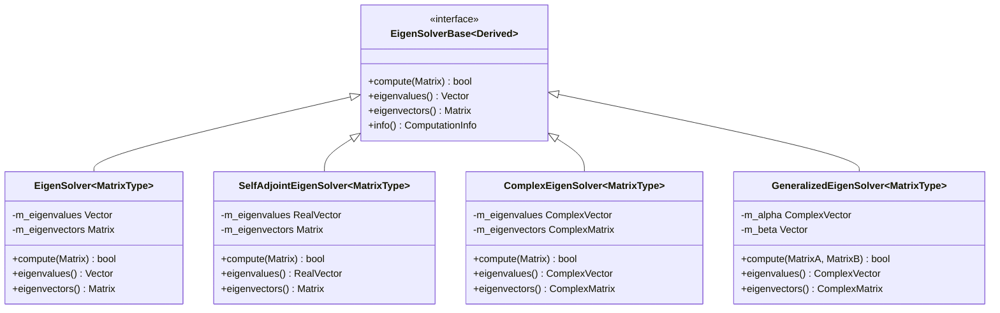

# 第五章：特征值和特征向量

## 类层次结构

> 本章介绍特征值计算相关的类。相关内容请参见：
> - 矩阵分解：[第二章](chp02.md#矩阵分解)
> - 线性方程：[第四章](chp04.md#类层次结构)
> - 稀疏矩阵：[第七章](chp07.md#类层次结构)



### 类说明
1. EigenSolver：通用特征值求解器
   - 适用于一般方阵
   - 返回实数或复数特征值
   - 计算复杂度 O(n³)

2. SelfAdjointEigenSolver：对称矩阵专用
   - 仅适用于对称/厄米特矩阵
   - 保证返回实数特征值
   - 性能优于通用求解器

3. ComplexEigenSolver：复数矩阵专用
   - 处理复数矩阵
   - 返回复数特征值和特征向量
   - 支持一般复数矩阵

## 5.1 基本概念

对于一个矩阵而言，特征值和特征向量是矩阵的最重要的性质之一。数学概念如下：

- 特征值方程：\(A\mathbf{v} = \lambda\mathbf{v}\)
  - \(A\) 是 \(n\times n\) 矩阵
  - \(\lambda\) 是特征值
  - \(\mathbf{v}\) 是对应的特征向量

在实际矩阵分析中，特征值和特征向量可以帮助我们理解矩阵的性质，比如矩阵的稳定性、振动特性、对角化等。这在实际的工程应用中非常重要。例如，在机械振动分析中，特征值和特征向量可以帮助我们理解机械系统的振动特性，从而进行结构优化和故障诊断。

### 5.1.1 特征值问题
- 定义：Ax = λx
- 计算复杂度：O(n³)
- 存储需求：O(n²)

### 5.1.2 特征值类型
- 实特征值：对称矩阵
- 复特征值：一般矩阵
- 重特征值：需要特殊处理

## 5.2 特征值计算

### 5.2.1 计算方法
- QR迭代：O(n³)，一般矩阵
- Jacobi迭代：O(n³)，对称矩阵
- Arnoldi迭代：O(kn²)，大型稀疏矩阵

### 5.2.2 数值稳定性
- 条件数影响
- 重特征值处理
- 收敛性分析

### 5.2.2 基本算法实现
#### 一般矩阵
```cpp
Matrix3d A;
// ... 初始化矩阵 A ...
EigenSolver<Matrix3d> solver(A);
Vector3cd eigenvalues = solver.eigenvalues();
Matrix3cd eigenvectors = solver.eigenvectors();
```

#### 实对称矩阵
```cpp
// 对于实对称矩阵，特征值和特征向量都是实数
SelfAdjointEigenSolver<Matrix3d> solver(A);
Vector3d eigenvalues = solver.eigenvalues();
Matrix3d eigenvectors = solver.eigenvectors();
```

### 5.2.3 性能优化
#### 计算优化
- 利用矩阵结构
- 选择合适算法
- 并行计算支持

#### 内存优化
- 避免不必要的拷贝
- 使用视图操作
- 重用计算结果

## 5.3 高级特征值计算

### 5.3.1 广义特征值问题
```cpp
// 求解 Ax = λBx
GeneralizedEigenSolver<Matrix3d> solver(A, B);
Vector3cd eigenvalues = solver.eigenvalues();
```

### 5.3.2 实对称广义特征值问题
```cpp
// 当A和B都是实对称矩阵时
GeneralizedSelfAdjointEigenSolver<Matrix3d> solver(A, B);
Vector3d eigenvalues = solver.eigenvalues();
```

## 5.4 应用实例

### 5.4.1 主成分分析（PCA）
```cpp
// 计算协方差矩阵
MatrixXd centered = data.rowwise() - data.colwise().mean();
MatrixXd cov = (centered.adjoint() * centered) / double(data.rows() - 1);

// 计算特征值和特征向量
SelfAdjointEigenSolver<MatrixXd> solver(cov);
VectorXd principal_values = solver.eigenvalues();
MatrixXd principal_vectors = solver.eigenvectors();
```

### 5.4.2 模态分析
```cpp
// 求解结构动力学特征值问题 Kx = λMx
GeneralizedSelfAdjointEigenSolver<MatrixXd> solver(K, M);
VectorXd frequencies = solver.eigenvalues().cwiseSqrt() / (2 * M_PI);
MatrixXd modes = solver.eigenvectors();
```

## 5.5 代码示例说明

### 5.5.1 `eigenvalues.cpp` 详解

这个示例展示了如何计算矩阵的特征值和特征向量，并验证计算结果。让我们逐行分析代码：

```cpp
Matrix3d A;
A << 1, 2, 3,
    2, 4, 5,
    3, 5, 6;
```
- 创建一个 3×3 的矩阵
- 使用逗号初始化语法填充矩阵
- 注意这是一个对称矩阵，因为 \(A_{ij} = A_{ji}\)

```cpp
EigenSolver<Matrix3d> solver(A);
```
一般特征值求解器：
- 可以处理任意方阵
- 返回的特征值和特征向量可能是复数
- 适用于非对称矩阵

```cpp
SelfAdjointEigenSolver<Matrix3d> symm_solver(A);
```
对称矩阵特征值求解器：
- 专门用于实对称矩阵
- 计算速度更快，数值稳定性更好
- 保证返回实数特征值

```cpp
Vector3cd eigenval = solver.eigenvalues();
Matrix3cd eigenvec = solver.eigenvectors();
```
获取特征值和特征向量：
- `Vector3cd` 表示3维复数向量
- `Matrix3cd` 表示3×3复数矩阵
- 特征向量按列存储，每列对应一个特征值

```cpp
for (int i = 0; i < 3; ++i) {
    cout << "λv =\n" << eigenval(i) * eigenvec.col(i) << "\n";
    cout << "Av =\n" << A * eigenvec.col(i) << "\n\n";
}
```
验证计算结果：
- 对每个特征值-特征向量对进行验证
- 检查 \(Av = \lambda v\) 是否成立
- `.col(i)` 获取第i列特征向量

#### 重要概念说明

1. 特征值求解器类型
   - `EigenSolver`: 一般矩阵
   - `SelfAdjointEigenSolver`: 实对称矩阵
   - `ComplexEigenSolver`: 复数矩阵

2. 数据类型
   - `Matrix3d`: 3×3实数矩阵
   - `Vector3cd`: 3维复数向量
   - `Matrix3cd`: 3×3复数矩阵

3. 特征值排序
   - `SelfAdjointEigenSolver` 默认按降序排列特征值
   - `EigenSolver` 的特征值排序可能不确定

4. 验证方法
   - 检查 \(Av = \lambda v\) 
   - 数值计算可能有小的误差
   - 特征向量的模长默认归一化

#### 注意事项
1. 对于实对称矩阵，优先使用 `SelfAdjointEigenSolver`
2. 验证结果时要考虑数值误差
3. 特征向量的方向可能与预期相反（因为 \(v\) 和 \(-v\) 都是特征向量）
4. 对于重特征值，对应的特征向量可能不唯一

### 5.5.2 `pca_example.cpp` 详解

这个示例展示了如何使用 Eigen 实现主成分分析（PCA）。让我们逐行分析代码：

```cpp
#include <Eigen/Dense>
```
引入 Eigen 的密集矩阵运算模块，包含了我们需要的所有矩阵操作。

```cpp
MatrixXd data(100, 3);
for (int i = 0; i < 100; ++i) {
    data.row(i) = Vector3d::Random();
}
```
- 创建 100×3 的数据矩阵，表示100个样本，每个样本有3个特征
- `Vector3d::Random()` 生成随机的3维向量
- `.row(i)` 访问矩阵的第i行

```cpp
MatrixXd centered = data.rowwise() - data.colwise().mean();
```
数据中心化处理：
- `.colwise().mean()` 计算每列的平均值
- `.rowwise()` 使减法运算按行进行
- 结果是每个特征都减去该特征的平均值

```cpp
MatrixXd cov = (centered.adjoint() * centered) / double(data.rows() - 1);
```
计算协方差矩阵：
- `.adjoint()` 获取矩阵的共轭转置
- 除以 `(n-1)` 得到无偏估计
- 结果是 3×3 的协方差矩阵

```cpp
SelfAdjointEigenSolver<MatrixXd> solver(cov);
```
创建特征值求解器：
- 使用 `SelfAdjointEigenSolver` 因为协方差矩阵是对称的
- 自动计算特征值和特征向量

```cpp
solver.eigenvalues()    // 获取特征值
solver.eigenvectors()   // 获取特征向量
```
- 特征值按降序排列
- 特征向量是归一化的，每列对应一个特征值

```cpp
MatrixXd pc = centered * solver.eigenvectors();
```
数据投影：
- 将中心化后的数据投影到特征向量构成的新空间
- 结果矩阵的列是主成分得分

#### 重要对象和方法说明

1. `MatrixXd`
   - `X` 表示大小可变
   - `d` 表示元素类型为 double
   - 常用操作：
     - `.rows()`: 获取行数
     - `.cols()`: 获取列数
     - `.row(i)`: 访问第i行
     - `.col(i)`: 访问第i列

2. `Vector3d`
   - 3维向量（固定大小）
   - 静态方法：
     - `::Random()`: 生成随机向量
     - `::Zero()`: 生成零向量
     - `::Ones()`: 生成全1向量

3. 矩阵运算
   - `.adjoint()`: 共轭转置
   - `.transpose()`: 转置
   - `.colwise()`: 按列操作
   - `.rowwise()`: 按行操作

4. `SelfAdjointEigenSolver`
   - 专门用于对称矩阵的特征值分解
   - 主要方法：
     - `eigenvalues()`: 获取特征值
     - `eigenvectors()`: 获取特征向量
     - `compute()`: 重新计算新矩阵的特征值

## 5.6 注意事项
1. 数值稳定性
   - 对于病态矩阵，结果可能不准确
   - 考虑使用预处理或平衡技术

2. 计算效率
   - 利用矩阵的特殊结构（对称、正定等）
   - 只计算需要的特征值/特征向量

3. 特征向量的归一化
   - 默认返回的特征向量是归一化的
   - 可以使用 `.normalized()` 重新归一化 