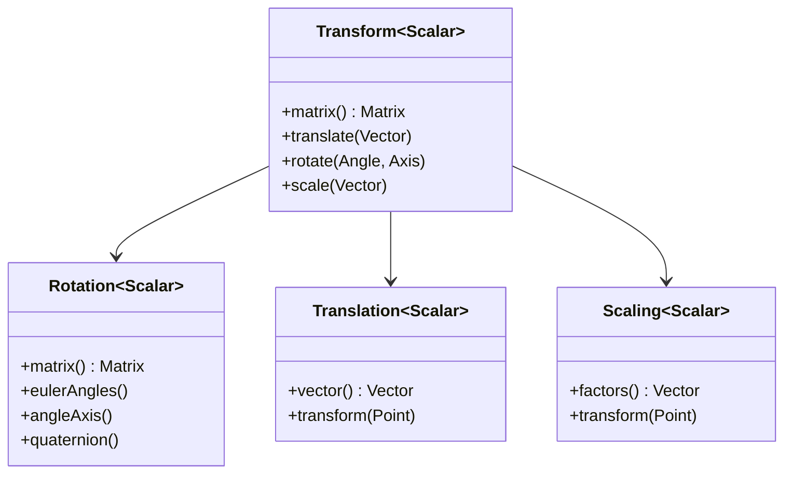

# Eigen 教程

## 教程目录
1. [基础知识](chp01.md)
   - 基本矩阵操作
   - 矩阵运算
   - 特殊矩阵
2. [矩阵操作](chp02.md)
   - 矩阵基本操作
   - 矩阵分解
3. [向量操作](chp03.md)
   - 向量基本操作
   - 向量高级特性
4. [线性方程](chp04.md)
   - 线性方程求解
   - 最小二乘法
5. [特征值](chp05.md)
   - 特征值计算
   - PCA实例
6. [几何变换](chp06.md)
   - 变换矩阵
   - 旋转矩阵
7. [高级特性](chp07.md)
   - 稀疏矩阵
   - 高级功能

<script type="module">
    import mermaid from 'https://cdn.jsdelivr.net/npm/mermaid@10/dist/mermaid.esm.min.mjs';
    mermaid.initialize({
        startOnLoad: true,
        theme: 'dark'
    });
</script>

# 第六章：几何变换

## 类层次结构

> 本章介绍几何变换相关的类。相关内容请参见：
> - 向量运算：[第三章](chp03.md#类层次结构)
> - 矩阵运算：[第二章](chp02.md#矩阵分解)
> - 稀疏变换：[第七章](chp07.md#类层次结构)



### 类说明
1. Transform：变换基类
  - 提供基本的变换操作
  - 支持组合变换
  - 继承自[第一章](chp01.md#类层次结构)的 MatrixBase

2. Rotation：旋转变换
  - 支持多种旋转表示
  - 提供旋转插值功能
  - 详细旋转操作见[第三章](chp03.md#四元数)

3. Translation：平移变换
  - 实现向量平移
  - 支持点的变换
  - 与向量运算紧密相关

4. Scaling：缩放变换
  - 支持非均匀缩放
  - 提供缩放插值
  - 可用于坐标系变换

## 6.1 基本概念

### 6.1.1 变换类型及其性质
- 刚体变换：保持距离不变
  * 复杂度：O(1)
  * 存储：12个参数
- 相似变换：保持角度不变
  * 复杂度：O(1)
  * 存储：13个参数
- 仿射变换：保持平行关系
  * 复杂度：O(1)
  * 存储：16个参数

### 6.1.2 变换表示方法
- 矩阵形式：4x4齐次矩阵
- 四元数+平移：7个参数
- 轴角+平移：6个参数

## 6.2 三维旋转表示

### 6.2.1 旋转表示方法
- 欧拉角：
  * 优点：直观易理解
  * 缺点：万向节死锁
  * 存储：3个参数

- 旋转矩阵：
  * 优点：组合方便
  * 缺点：参数冗余
  * 存储：9个参数

- 四元数：
  * 优点：紧凑稳定
  * 缺点：不直观
  * 存储：4个参数

### 6.2.1 欧拉角
```cpp
// 从旋转矩阵获取欧拉角
Vector3d euler = R.eulerAngles(2, 1, 0); // ZYX顺序
```

## 6.3 基本变换

Eigen 提供了多种几何变换类型，包括平移、旋转、缩放等。

主要的变换类型包括：
- Translation3d：平移变换
- AngleAxisd：轴角旋转
- Quaterniond：四元数旋转
- Scaling3d：缩放变换

### 6.1.1 平移
```cpp
Vector3d translation(1, 2, 3);
Translation3d t(translation);
// 或者直接使用向量
Translation3d t(1, 2, 3);
```

### 6.1.2 旋转

Eigen 提供了多种旋转表示方法，每种方法都有其特点和适用场景：

1. Matrix3d（旋转矩阵）
   - 3x3 双精度矩阵
   - 直观但参数冗余（9个参数表示3自由度）
   - 成员函数：
     * eulerAngles(i,j,k): 提取欧拉角，i,j,k指定轴的顺序


2. AngleAxisd（轴角表示）
   - 最简单的旋转表示方法
   - 构造函数：AngleAxisd(angle, axis)
   - 成员函数：
     * angle(): 获取旋转角度
     * axis(): 获取旋转轴
     * matrix(): 转换为矩阵形式
   - 可以直接相乘组合多个旋转

3. Quaterniond（四元数）
   - 最稳定的旋转表示方法
   - 构造函数：
     * Quaterniond(w,x,y,z): 直接指定四元数分量
     * Quaterniond(Matrix3d): 从旋转矩阵构造
     * Quaterniond(AngleAxisd): 从轴角构造
   - 成员函数：
     * w(),x(),y(),z(): 获取四元数分量
     * matrix(): 转换为矩阵形式
     * normalized(): 归一化

示例代码：
```cpp
// 使用欧拉角（ZYX顺序）
Matrix3d R = AngleAxisd(yaw, Vector3d::UnitZ())
           * AngleAxisd(pitch, Vector3d::UnitY())
           * AngleAxisd(roll, Vector3d::UnitX());

// 使用四元数
Quaterniond q = AngleAxisd(angle, axis);
```

### 6.1.3 缩放
```cpp
Vector3d scale(2, 2, 2);
Scaling3d s(scale);
// 或者直接使用标量
Scaling3d s(2.0);
```

## 6.3 变换组合

在实际应用中，我们经常需要将多个变换组合在一起，比如先旋转再平移。Eigen 提供了多种变换组合的方式。

### 6.3.1 仿射变换
```cpp
// 创建变换矩阵
Affine3d transform = Translation3d(1, 2, 3)
                   * AngleAxisd(M_PI/2, Vector3d::UnitZ())
                   * Scaling3d(2.0);

// 应用变换
Vector3d point(1, 0, 0);
Vector3d transformed = transform * point;
```

### 6.3.2 刚体变换
```cpp
// 使用Isometry3d表示刚体变换（旋转+平移）
Isometry3d T = Isometry3d::Identity();
T.rotate(q);
T.pretranslate(Vector3d(1, 2, 3));
```

## 6.4 代码示例说明

### 6.4.1 transforms.cpp 详解
这个示例展示了如何使用 Eigen 进行基本的几何变换。让我们逐行分析代码：

```cpp
// 创建一个点和变换
Vector3d point(1, 0, 0);  // 在x轴上的点
cout << "原始点: " << point.transpose() << endl;

// 1. 平移变换
Translation3d translation(1, 2, 3);  // 在x,y,z方向分别平移1,2,3单位
Vector3d translated = translation * point;
cout << "平移后: " << translated.transpose() << endl;
```
- `Vector3d` 用于表示3D点或向量
- `Translation3d` 专门用于表示平移变换
- `.transpose()` 用于横向打印向量

```cpp
// 2. 旋转变换
AngleAxisd rotation(M_PI/2, Vector3d::UnitZ());  // 绕Z轴旋转90度
Vector3d rotated = rotation * point;
cout << "旋转后: " << rotated.transpose() << endl;
```
- `AngleAxisd` 使用轴角表示旋转
- `M_PI` 是数学常数π
- `Vector3d::UnitZ()` 表示Z轴单位向量(0,0,1)

```cpp
// 3. 缩放变换
Scaling3d scale(2.0, 2.0, 2.0);  // 各方向放大2倍
Vector3d scaled = scale * point;
cout << "缩放后: " << scaled.transpose() << endl;
```
- `Scaling3d` 用于表示缩放变换
- 可以在不同方向设置不同的缩放因子

```cpp
// 4. 组合变换
Affine3d transform = translation * rotation * scale;
Vector3d transformed = transform * point;
cout << "组合变换后: " << transformed.transpose() << endl;
```
- `Affine3d` 可以表示任意仿射变换
- 变换的组合顺序很重要：先缩放，再旋转，最后平移

### 6.4.2 rotations.cpp 详解
这个示例展示了旋转的不同表示方法及其转换。让我们详细分析代码：

```cpp
// 定义欧拉角（弧度制）
double yaw = M_PI / 4;    // 绕Z轴旋转45度
double pitch = M_PI / 6;  // 绕Y轴旋转30度
double roll = M_PI / 3;   // 绕X轴旋转60度
```
- 使用弧度制表示角度
- 遵循ZYX顺序（偏航-俯仰-滚转）
- 这是航空航天中常用的欧拉角顺序

```cpp
// 从欧拉角创建旋转矩阵
Matrix3d R = (AngleAxisd(yaw, Vector3d::UnitZ()) * 
              AngleAxisd(pitch, Vector3d::UnitY()) * 
              AngleAxisd(roll, Vector3d::UnitX())).matrix();
```
- 使用轴角表示创建基本旋转
- 按照Z-Y-X顺序组合旋转
- `.matrix()` 将旋转转换为矩阵形式

```cpp
// 从旋转矩阵提取欧拉角
Vector3d euler = R.eulerAngles(2, 1, 0);  // ZYX顺序
```
- `eulerAngles(2,1,0)` 指定提取顺序：2=Z轴，1=Y轴，0=X轴
- 返回的角度范围：
  * Z轴：[-π, π]
  * Y轴：[-π/2, π/2]
  * X轴：[-π, π]

```cpp
// 四元数表示
Quaterniond q(R);  // 从旋转矩阵构造四元数
cout << "四元数:\n"
     << "w: " << q.w() << "\n"  // 实部
     << "x: " << q.x() << "\n"  // 虚部i
     << "y: " << q.y() << "\n"  // 虚部j
     << "z: " << q.z() << "\n"; // 虚部k
```
- 四元数形式：w + xi + yj + zk
- w 是实部，(x,y,z)是虚部
- 四元数自动归一化：w² + x² + y² + z² = 1

```cpp
// 轴角表示
AngleAxisd aa(R);  // 从旋转矩阵构造轴角
cout << "轴角表示:\n"
     << "角度: " << aa.angle() * 180 / M_PI << " 度\n"
     << "轴: " << aa.axis().transpose() << "\n";
```
- 轴角表示：绕固定轴旋转特定角度
- `angle()` 返回旋转角度（弧度）
- `axis()` 返回旋转轴的单位向量

#### 重要概念说明
1. 旋转表示的选择：
   - 欧拉角：直观但有万向节死锁问题
   - 旋转矩阵：计算方便但参数冗余
   - 四元数：紧凑且稳定，适合插值
   - 轴角：最符合人类直觉

2. 常见应用场景：
   - 机器人运动学：描述关节旋转
   - 计算机图形学：相机视角变换
   - 姿态估计：传感器数据融合

3. 性能考虑：
   - 存储：四元数最省内存
   - 计算：旋转矩阵乘法最快
   - 插值：四元数球面线性插值最平滑

## 6.5 实践建议
1. 选择合适的变换类型
   - Isometry3d：刚体变换
   - Affine3d：一般仿射变换
   - Projective3d：投影变换

2. 避免万向节死锁
   - 注意欧拉角的使用顺序
   - 考虑使用四元数

3. 性能优化
   - 缓存变换矩阵
   - 使用适当的数据类型 